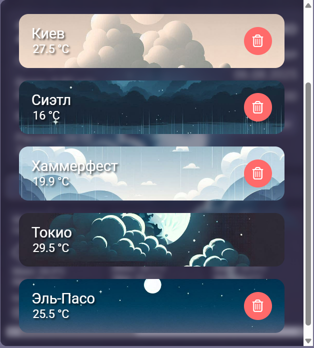

# React Weather Widget 🌦

Интерактивный погодный виджет на **React + Webpack**, который определяет ваше местоположение по IP (через Cloudflare Worker) и отображает текущую погоду.

---

## 🚀 Live Demo
[Открыть демо на GitHub Pages](...)

---

## 📸 Скриншоты

### Виджет в действии


### Панель управления городами


---

## 📌 Возможности
- Автоматическое определение города по IP (без запроса разрешения геолокации)
- Получение погодных данных с внешнего API
- Возможность добавить несколько городов
- Минималистичный дизайн и адаптивная верстка


---

## 🛠 Технологии
- **React**
- **Webpack**
- **JavaScript (ES6+)**
- **SCSS Modules**
- **Cloudflare Workers** (для получения IP клиента)

---

## 📂 Установка и запуск локально

```bash
# Клонировать репозиторий
git clone ...

# Перейти в папку проекта
cd react-weather-widget

# Установить зависимости
npm install

# Запустить проект в режиме разработки
npm start

# Или собрать проект для продакшена, и после в папке dist запустить index.html 
npm run build:prod
