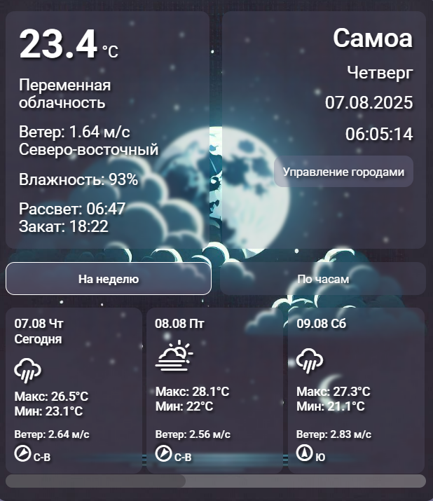
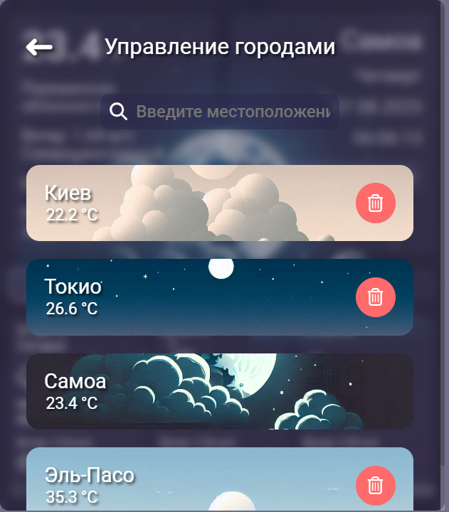

# React Weather Widget 🌦

Інтерактивний віджет на **React + Webpack**, який визначає ваше місцезнаходження по IP (через Cloudflare Worker) та відображає поточну погоду.

Спочатку цей проект був створений для практики JavaScript, з імпровізованим дизайном без попередньо визначеного макета.
Відтоді я перейшов на більш сучасні підходи до розробки, але цей проєкт я зберігаю як орієнтир для демонстрації свого прогресу.

---

## 🚀 Live Demo
[Відкрити демо на GitHub Pages](https://nikita-7onenko-dev.github.io/React-Weather-Widget/)

---

## 📸 Скріншоти

### Віджет у дії



### Панель управління містами


---

## 📌 Можливості
- Автоматичне визначення міста IP (без запиту дозволу геолокації)
- Отримання погодних даних із зовнішнього API
- Можливість додати кілька міст

---

## 🛠 Технологии
- **React**
- **Webpack**
- **JavaScript (ES6+)**
- **SCSS Modules**
- **Cloudflare Workers** (для отримання IP клиента)

---

## 📂 Встановлення та запуск локально


### Клонувати репозиторій
```bash
git clone (https://github.com/Nikita-7onenko-dev/React-Weather-Widget.git)
```

### Перейти до папки проекту
```bash
cd react-weather-widget
```

### Встановити залежності
```bash
npm install
```

### Запустити проект у режимі розробки
```bash
npm start
```

### Або зібрати проект для продакшену, і потім у папці dist запустити index.html 
```
npm run build:prod
```
